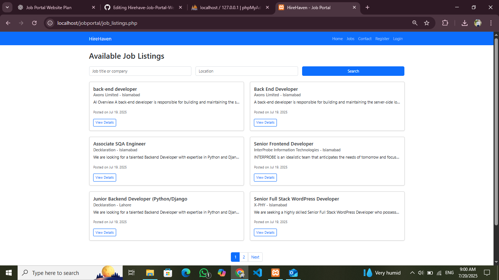
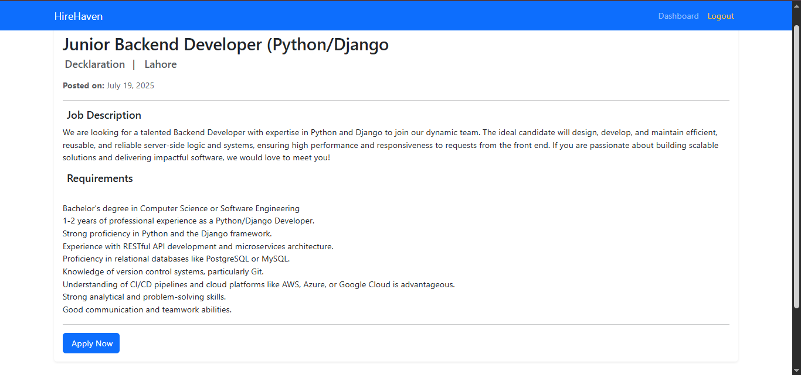

# 💼 HireHaven – Complete Job Portal Website (PHP + MySQL)

 <!-- Optional: Replace with actual banner image -->

HireHaven is a full-featured Job Portal built using **PHP**, **MySQL**, **Bootstrap**, and **JavaScript**. It allows job seekers to search and apply for jobs, while employers can post, manage, and review applications. Admins can oversee the entire platform. Ideal for learning web app development from scratch.

---

## 📸 Key Screenshots

| Homepage | Job Details | Apply Job | 
|----------|-------------|-----------|
|  |  |  |

| Seeker Dashboard | Employer Dashboard | Admin Panel |
|------------------|--------------------|-------------|
|  |  |  |

---

## ✨ Features

### 👤 Job Seeker

- Register, login and update profile (resume, education, experience)
- Browse and search jobs by title or location
- View job details and apply directly
- View application status (Pending, Shortlisted, Rejected)
- See employer feedback on applications

### 🧑‍💼 Employer

- Register and manage posted jobs
- Post new job listings with details
- View applicants for each job
- Shortlist, reject or add notes to applications

### 🔐 Admin

- View and delete any user (seeker or employer)
- Manage job listings across the platform
- Review and manage job applications
- View messages from Contact Us form

---

## 🛠️ Tech Stack

| Frontend        | Backend     | Database  |
|-----------------|-------------|-----------|
| HTML, CSS, Bootstrap 5 | Core PHP       | MySQL      |
| JavaScript      | PDO + MySQLi | Session-based auth |

---

## 🔐 Pages Overview

### 👨‍💼 Public
- `index.php` – Homepage with latest jobs
- `job_details.php` – Full job description
- `contact.php` – Message admin

### 👨‍🔧 Authentication
- `register.php` / `login.php` – Register & Login (Seeker or Employer)

### 👨‍🎓 Seeker
- `/seeker/dashboard.php` – Profile + Recent Applications
- `/seeker/search_jobs.php` – Search jobs with filters + pagination
- `/seeker/apply_jobs.php` – Apply for a job
- `/seeker/edit_profile.php` – Update resume and info

### 🧑‍💼 Employer
- `/employer/dashboard.php` – Post/manage jobs + view applications
- `/employer/post_job.php` – Add job post
- `/employer/manage_jobs.php` – Edit/Delete jobs
- `/employer/view_applicants.php` – See who applied and filter by status

### 🔐 Admin
- `/admin/dashboard.php` – Admin panel overview
- `/admin/manage_users.php` – Manage all users
- `/admin/manage_jobs.php` – Manage all job posts
- `/admin/view_messages.php` – View contact form messages
- `/admin/view_applications.php` – View all applications

---

## 🚀 Getting Started (Run Locally)

1. **Clone the Repository**
   ```bash
   git clone https://github.com/AsadNoman55/Hirehaven-Job-Portal-Website 

